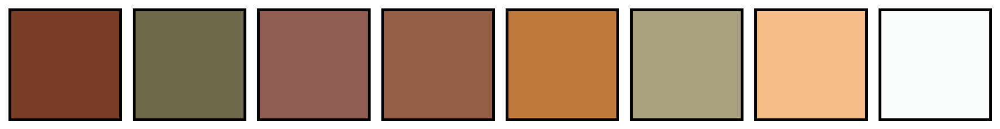

<a name="readme-top"></a>

<!-- Top Links Bar -->

[![LinkedIn][linkedin-shield]][linkedin-url]
[![X][x-shield]][x-url]
[![Instagram][instagram-shield]][instagram-url]

<!-- PROJECT LOGO -->
<br />

<div align="center">
  
  <h1 align="center">TDD and clean architecture</h1>

  <p align="left">
     Riverpod and clean architecture template app
  </p>
  
  <p align="left">
    <a href="https://github.com/foxnoir/riverpod_clean_architecture_template/tree/develop/lib"><strong>Explore the project »</strong></a>
    <br/>
  </p>
</div>

<details>
  <summary>Table of Contents</summary>
  <ol>
    <li>
      <a href="#clean-architecture-roadmap">Clean Architecture Roadmap</a>
      <ul>
        <li><a href="#domain-layer">Domain Layer</a></li>
      </ul>
      <ul>
        <li><a href="#data-layer">Data Layer</a></li>
      </ul>
      <ul>
        <li><a href="#presentation-layer">Presentation Layer</a></li>
      </ul>
    </li>
    <li>
      <a href="#riverpod">Riverpod</a>
      <ul>
        <li><a href="#why-riverpod-instead-of-provider">Why Riverpod instead of Provider</a></li>
      </ul>
      <ul>
        <li><a href="#core-riverpod-provider">Core Riverpod Provider</a></li>
      </ul>
      <ul>
        <li><a href="#summary">Summary</a></li>
      </ul>
      <ul>
        <li><a href="#conclusion">Conclusion</a></li>
      </ul>
    </li>
    <li>
      <a href="#riverpod-hooks">Riverpod Hooks</a>
      <ul>
        <li><a href="#when-are-hooks-useful-in-riverpod">When Are Hooks Useful in Riverpod?</a></li>
      </ul>
      <ul>
        <li><a href="#when-is-hookconsumerwidget-necessary">When Is HookConsumerWidget Necessary?</a></li>
      </ul>
      <ul>
        <li><a href="#important-riverpod-hooks">Important Riverpod Hooks</a></li>
      </ul>
      <ul>
        <li><a href="#when-shoukd-you-use-consumerstatefulwidget">When Should You Use ConsumerStatefulWidget?</a></li>
      </ul>
      <ul>
        <li><a href="#when-is-consumerstatefulwidget-required">When Is ConsumerStatefulWidget Required?</a></li>
      </ul>
      <ul>
        <li><a href="#summary">summary</a></li>
      </ul>
    </li>
    <li>
      <a href="#style-guide">Style Guide</a>
      <ul>
        <li><a href="#color-palette">Color Palette</a></li>
      </ul>
      <ul>
        <li><a href="#fonts">Fonts</a></li>
      </ul>
      <ul>
        <li><a href="#icons">Icons</a></li>
      </ul>
      <ul>
        <li><a href="#final-layout">Final Layout</a></li>
      </ul>
    </li>
    <li><a href="#app-demonstration">App Demonstration</a>
      <ul>
        <li><a href="#happy-case">Happy Case</a></li>
        <li><a href="#error-handling">Error Handling</a></li>
      </ul>
    </li>
    <li><a href="#tech-stack">Tech Stack</a></li>
      <ul>
        <li><a href="#build-with">Build With</a></li>
      </ul>
    <ul>
        <li><a href="#most-important-packages-and-tools-used">Most important Packages and Tools used</a></li>
      </ul>
    <li><a href="#getting-started">Getting Started</a></li>
        <ul>
        <li><a href="#generate-launcher-icon">Generate Launcher Icon</a></li>
        <li><a href="#generate-splash-screen">Generate Splash Screen</a></li>
      </ul>
    <li><a href="#app-architecture-and-folder-structure">App Architecture and Folder Structure</a>
      <ul>
        <li><a href="#feature-first-approach">Feature-First Approach</a></li>
        <li><a href="#explanation">Explanation</a>
          <ul>
            <li><a href="#data">Data</a></li>
            <li><a href="#domain">Domain</a></li>
            <li><a href="#presentation">Presentation</a></li>
            <li><a href="#global-widgets">Global Widgets</a></li>
          </ul>
        </li>
      </ul>
    </li>
    <li><a href="#packages-and-reasons-for-use">Packages and Reasons for Use</a></li>
    <li><a href="#test-coverage">Test Coverage</a></li>
    <li><a href="#changelog">Changelog</a></li>
    <li>
      <a href="#testing-tips">Testing Tips</a>
      <ul>
        <li><a href="#testing-futurevoid-methods-in-dartflutter">Testing Future<void> Methods in Dart/Flutter</a></li>
     </ul>
    </li>
    <li><a href="#acknowledgments">Acknowledgments</a>
      <ul>
        <li><a href="#go-router">Go Router</a></li>
     </ul>
    </li>
    <li><a href="#sources">Sourcs</a></li>
  </ol>
</details>

---

## Clean Architecture Roadmap

Work through the layers one after the other.
What the individual classes do is usually described in more detail in the classes themselves.

### Domain Layer

#### 1.<ins>entities using [equatable](https://pub.dev/packages/equatable)</ins>

#### Why do we need `equatable` in Flutter?

The `equatable` package is an essential tool in Flutter that simplifies object equality comparisons. It is particularly useful in scenarios such as state management and comparing data models. While Dart allows overriding the == method and hashCode, this process can be verbose and error-prone. The `equatable` package provides a more straightforward and reliable alternative for handling equality.

#### Benefits of `equatable`

1. **Simplifies Equality Comparisons**  
   Dart’s default equality checks are based on reference equality (`==` compares object references). This can lead to issues when dealing with objects that should be compared by their values instead of their memory addresses.

2. **Reduces Boilerplate Code**  
   Without `equatable`, you would need to manually override `==` and `hashCode` for every class that requires custom equality comparison. `equatable` simplifies this by requiring only a `props` list to define the fields for comparison.

3. **Essential for State Management**  
   In state management solutions like **Riverpod**, proper equality checks are critical for detecting state changes. `equatable` ensures that states are compared based on their property values, preventing unnecessary widget rebuilds.

4. **Improves Code Readability**  
   By removing verbose equality logic, `equatable` makes code cleaner and more maintainable.

5. **Supports Better Testing**  
   When writing unit tests, `equatable` allows you to compare objects directly without implementing custom equality logic.

<p align="right"><a href="#readme-top">back to top</a></p>

#### 2. <ins>repositories using [dartz](https://pub.dev/packages/dartz/versions)</ins>

#### Why do we need `dartz` in Flutter?

The `dartz` package brings **functional programming concepts** to Dart, allowing developers to write safer and more expressive code. It is particularly useful for handling errors, managing optional values, and composing functional operations in Flutter apps.

#### Benefits of `dartz`

1. **Provides `Either` for Error Handling**  
   The `Either` type is a powerful way to handle success (`Right`) and failure (`Left`) in a single object. It eliminates the need for throwing exceptions and simplifies error propagation.

2. **Optional Values with `Option`**  
   `Option` helps manage nullable data without relying on `null`, enforcing safer code by explicitly handling the absence of a value. While Dart's null safety provides static guarantees, `Option` makes nullable values explicit and avoids runtime null checks.“

3. **Immutability Support**  
   Functional programming principles like immutability are easy to implement with `dartz`, helping you build predictable and bug-free code.

4. **Functional Programming Utilities**  
   `dartz` includes functional constructs like `fold`, `map`, and `flatMap` for transforming and chaining operations cleanly.

5. **Cleaner Code and Better Testing**  
   By using `dartz`, your code becomes more declarative and testable, as error paths and nullable values are explicitly defined.

<p align="right"><a href="#readme-top">back to top</a></p>

#### 3. <ins>usecases</ins>

Write a usecase for each methods functionality in a repository.

Write tests:

- What does the class depend on?
- How can we create a fake version of the dependency?
- How do we control what our dependencies do?

Get tests past. (Implement usecase methods functionality.)
First Happy Cases, then try/catch (error handling).

<p align="right"><a href="#readme-top">back to top</a></p>

#### Why Are Use Cases Important in Clean Architecture?

In **Clean Architecture**, use cases are at the core of the application’s business logic. They define **what** the application should do, regardless of **how** it is implemented. Here’s why they are crucial:

#### What Is a Use Case?

A **Use Case** is a class or function that represents a **specific task or action** the user or system performs within the application.

**Examples:**

- Logging in a user.
- Fetching a list of items.
- Submitting a form.

<p align="right"><a href="#readme-top">back to top</a></p>

#### Responsibilities of Use Cases

1. **Encapsulating Business Logic**  
   Use cases contain business rules and ensure no logic leaks into other layers, like the UI or data layers.

2. **Framework Independence**  
   Use cases are not tied to external libraries or UI technologies, making them platform-agnostic.

3. **Communication Between Layers**  
   Use cases act as a **bridge** between the **UI layer** and the **data layer**.

#### Why Are Use Cases Important?

- **Encapsulate Business Logic:** Keep the logic separate from the UI and data layers.
- **Reusability:** Use cases can be shared across platforms.
- **Testability:** They are easy to isolate and test.
- **Separation of Concerns:** By separating concerns, they make the code more maintainable.

<p align="right">
  <a href="#testing-tips">More Testing Tips</a> <a href="#readme-top">Back to Top</a>
</p>

### Data Layer

#### 1. <ins>models extenting entities using [mappable](https://pub.dev/packages/dart_mappable)</ins>

Create Models.

Write test using json-files to mimic server.

#### 2. <ins>Implement Repositories</ins>

Create datasource interface and implement repos. (no logic)

Write tests.

Get tests past. (Implement repo methods functionality.)
First Happy Cases, then try/catch (error handling).

<p align="right">
  <a href="#testing-tips">More Testing Tips</a> <a href="#readme-top">Back to Top</a>
</p>

#### 3. <ins>Data Sources</ins>

Implement datasource and add api/server connection. (no logic)

Write tests.

Get tests past. (Implement datasource methods functionality.)
First Happy Cases, then try/catch (error handling).

<p align="right">
  <a href="#testing-tips">More Testing Tips</a> <a href="#readme-top">Back to Top</a>
</p>

---

### Presentation Layer

If you were to use 2 different status management solutions at the same time, you would have another folder `app` in here. Here we only work with [Riverpod](https://fnfidanci.medium.com/the-right-way-to-use-riverpod-in-flutter-77869f9b741c).


#### 1. <ins>State Managment here with: [Riverpod](https://pub.dev/packages/flutter_riverpod)</ins>

`Riverpod`depends on `usecases`.

Implement riverpod_files.
Write test for riverpod_files.

<p align="right"><a href="#readme-top">back to top</a></p>

#### 2. <ins>Finally UI using using [GetIt](https://pub.dev/packages/get_it) for dependency injection</ins>

<p align="right"><a href="#readme-top">back to top</a></p>

---

## [Riverpod](https://pub.dev/packages/riverpod)

Riverpod is a **state management framework** for Flutter that improves upon Provider. It provides a **safe, testable, and flexible** way to manage dependencies and control the state of an application.

* * * * *

**1\. What Does a Provider Do?**
--------------------------------

A **Provider** in Riverpod has three main tasks:

1.  **Creates a resource or state**:

    -   This can be a simple value, a class, or complex logic.
2.  **Stores this state throughout the app lifecycle**:

    -   This ensures that values persist even when a widget is rebuilt.
3.  **Notifies widgets when the state changes**:

    -   Riverpod automatically rebuilds widgets when the observed state updates.

* * * * *

**2\. Difference Between `Provider` and `State`**
-------------------------------------------------

A **Provider** is a data source, but not all Providers have a state.

-   **Provider** = Returns a value (immutable).
-   **StateProvider** = Stores a value that can change.

A Provider is essentially **a source of data**, while a state is **a momentary variable** that can be modified.

### Core Riverpod Provider

Riverpod offers different providers for **various types of states**.

#### **1. Provider (Constant / Read-only computed value)**

A `Provider` delivers an immutable piece of information:

```dart
final helloProvider = Provider((ref) => "Hello, Riverpod!");
```
----------------------------------------------------------
<p align="right"><a href="#readme-top">back to top</a></p>


#### **2. StateProvider: Mutable State**

Use `StateProvider` when you have a simple variable that needs to be updated.

```dart
final counterProvider = StateProvider<int>((ref) => 0);

class CounterScreen extends ConsumerWidget {
  @override
  Widget build(BuildContext context, WidgetRef ref) {
    final counter = ref.watch(counterProvider);
    return Scaffold(
      body: Center(
        child: Column(
          children: [
            Text("Counter: $counter"),
            ElevatedButton(
              onPressed: () => ref.read(counterProvider.notifier).state++,
              child: Text("Increase"),
            ),
          ],
        ),
      ),
    );
  }
}
```
----------------------------------------------------------
**How Does It Work?**

-   `StateProvider<int>` holds a **modifiable number**.
-   `ref.watch(counterProvider)` observes this value and rebuilds the widget when it changes.
-   `ref.read(counterProvider.notifier).state++` updates the value.

**When to Use `StateProvider`?**

-   When you need to manage **small, local states**.
-   For simple **counters, form data, or flags**.


#### **3. FutureProvider: Asynchronous Data**

A `FutureProvider` is used for **asynchronous data**, such as API requests.

```dart
final userNameProvider = FutureProvider<String>((ref) async {
  await Future.delayed(Duration(seconds: 2));
  return "John Doe";
});

class UserScreen extends ConsumerWidget {
  @override
  Widget build(BuildContext context, WidgetRef ref) {
    final userAsync = ref.watch(userNameProvider);
    return Scaffold(
      body: Center(
        child: userAsync.when(
          data: (name) => Text("Hello, $name!"),
          loading: () => CircularProgressIndicator(),
          error: (err, stack) => Text("Error: $err"),
        ),
      ),
    );
  }
}
```
----------------------------------------------------------
**How Does It Work?**

-   `FutureProvider` manages an **asynchronous state**.
-   `when(data, loading, error)` ensures that all **three possible states** are handled.

**When to Use `FutureProvider`?**

-   For **API requests**.
-   When retrieving **data from a database**.
-   When fetching **SharedPreferences data**.


#### **4 StreamProvider: Continuous Real-Time Data**

A `StreamProvider` is useful for **continuous data streams**, such as Firebase Firestore.

```dart
final timeProvider = StreamProvider<DateTime>((ref) async* {
  while (true) {
    await Future.delayed(Duration(seconds: 1));
    yield DateTime.now();
  }
});

class ClockScreen extends ConsumerWidget {
  @override
  Widget build(BuildContext context, WidgetRef ref) {
    final time = ref.watch(timeProvider);
    return Scaffold(
      body: Center(
        child: time.when(
          data: (time) => Text("Time: ${time.toIso8601String()}"),
          loading: () => CircularProgressIndicator(),
          error: (err, stack) => Text("Error: $err"),
        ),
      ),
    );
  }
}
```
----------------------------------------------------------
**How Does It Work?**

-   `StreamProvider` **continuously emits new values**.
-   The widget **automatically updates** when the value changes.

**When to Use `StreamProvider`?**

-   For **WebSocket connections**.
-   When using **real-time updates from Firestore**.
-   For **real-time clocks or sensor data**.

<p align="right"><a href="#readme-top">back to top</a></p>

#### **5. StateNotifierProvider: Managing Complex States**

For larger states with multiple variables and methods, `StateNotifierProvider` is ideal.

```dart
class CounterNotifier extends StateNotifier<int> {
  CounterNotifier() : super(0);
  void increment() => state++;
}


final counterNotifierProvider = StateNotifierProvider<CounterNotifier, int>(
  (ref) => CounterNotifier(),
);

class CounterScreen extends ConsumerWidget {
  @override
  Widget build(BuildContext context, WidgetRef ref) {
    final counter = ref.watch(counterNotifierProvider);
    return Scaffold(
      body: Center(
        child: Column(
          children: [
            Text("Counter: $counter"),
            ElevatedButton(
              onPressed: () => ref.read(counterNotifierProvider.notifier).increment(),
              child: Text("Increase"),
            ),
            ElevatedButton(
              onPressed: () => ref.read(counterNotifierProvider.notifier).decrement(),
              child: Text("Decrease"),
            ),
          ],
        ),
      ),
    );
  }
}
```
----------------------------------------------------------
**How Does It Work?**

-   `StateNotifier<int>` manages the state.
-   `increment()` and `decrement()` modify the value.
-   `StateNotifierProvider` ensures **a clean separation of logic**.

**When to Use `StateNotifierProvider`?**

-   When your state consists of **multiple values or methods**.
-   For **login status, shopping cart, complex forms, or app state**.

<p align="right"><a href="#readme-top">back to top</a></p>


### Summary: Which Provider Should I Use?
---------------------------------------------

| Provider | Description | Best Use Case |
| --- | --- | --- |
| `Provider` | Static values (e.g., Strings, singletons) | Config, constants |
| `StateProvider` | Simple mutable state | Counters, forms, booleans |
| `FutureProvider` | One-time async operations | API requests, database calls |
| `StreamProvider` | Continuous real-time data | Firestore, Websockets |
| `StateNotifierProvider` | Complex state with methods | Authentication, shopping cart |

* * * * *

<p align="right"><a href="#readme-top">back to top</a></p>


### Conclusion

Riverpod is a **safe, structured, and scalable** way to manage state in Flutter applications.\
With **various providers**, it covers **simple**, **asynchronous**, and **complex** state management needs, making it a great choice for both small and large projects.

By understanding **how Providers work**, how to **handle states properly**, and when to use **StateProvider, FutureProvider, StreamProvider, and StateNotifierProvider**, you can **build robust and maintainable Flutter applications** efficiently.

<p align="right"><a href="#readme-top">back to top</a></p>

---

## [Riverpod Hooks](https://pub.dev/packages/hooks_riverpod)


Riverpod Hooks are an extension of **Flutter Hooks** that simplify working with Riverpod providers inside widgets.\
They come from the **hooks_riverpod** package (`package:hooks_riverpod/hooks_riverpod.dart`) and **reduce boilerplate code while improving performance**.

<p align="right"><a href="#readme-top">back to top</a></p>

### When Are Hooks Useful in Riverpod?

-   When you need **local state** without using `StatefulWidget`.
-   When you need to execute a function **only once when a widget is built** (like `initState()`).
-   When you want to **store expensive calculations or data** without recomputing them.

<p align="right"><a href="#readme-top">back to top</a></p>


### When Is HookConsumerWidget Necessary?

`HookConsumerWidget` is **only necessary** when using Hooks like `useState`, `useEffect`, or `useMemoized`.\
If you are only using `ref.watch()` or `ref.read()`, `ConsumerWidget` is sufficient.

| **Widget** | **When to Use?** |
| --- | --- |
| `ConsumerWidget` | When you only retrieve Riverpod providers (`ref.watch()` or `ref.read()`). |
| `HookConsumerWidget` | When you use hooks like `useState`, `useEffect`, or `useMemoized`. |

 
<p align="right"><a href="#readme-top">back to top</a></p>

## Important Riverpod Hooks

### **`useState` -- Local State Without `StatefulWidget`**

```dart
final counter = useState(0);
```
----------------------------------------------------------
Stores a simple **local UI state**, like counters or form inputs.


### **`useEffect` -- Like `initState()`, for Lifecycle Events**

```dart
useEffect(() {
  print("This widget was created");
  return null; // Cleanup function (optional)
}, const []);
```
----------------------------------------------------------
Executes a function **once when the widget is built**.

### **`useMemoized` -- Caching Expensive Calculations**

```dart
final result = useMemoized(() => performExpensiveCalculation(), []);
```
----------------------------------------------------------
Stores expensive calculations and **only recomputes them when dependencies change**.

<p align="right"><a href="#readme-top">back to top</a></p>


### When Should You Use ConsumerStatefulWidget?


Although **`HookConsumerWidget`** can replace `ConsumerStatefulWidget` in many cases, there are **specific situations** where `ConsumerStatefulWidget` is still necessary.

### **Key Differences: `HookConsumerWidget` vs. `ConsumerStatefulWidget`**

| Widget | When to Use? |
| --- | --- |
| **`HookConsumerWidget`** | If you need **Hooks for managing state** (`useState`, `useEffect`, `useMemoized`). |
| **`ConsumerStatefulWidget`** | If you need **complex UI state** that persists across widget rebuilds (e.g., `AnimationController`, `TabController`). |


<p align="right"><a href="#readme-top">back to top</a></p>

### When Is ConsumerStatefulWidget Required?

#### **1. If You Need `initState()` or `dispose()`**

**If your widget requires `initState()` or `dispose()`, you must use `ConsumerStatefulWidget`.**\
Hooks can replace `initState()` for simple cases (`useEffect`), but they cannot directly handle `dispose()`.


#### **Example: Using `AnimationController`**

This example demonstrates why `ConsumerStatefulWidget` is necessary when working with an `AnimationController`:

```dart
class AnimatedBox extends ConsumerStatefulWidget {
  @override
  _AnimatedBoxState createState() => _AnimatedBoxState();
}

class _AnimatedBoxState extends ConsumerState<AnimatedBox>
    with SingleTickerProviderStateMixin {
  late AnimationController _controller;

  @override
  void initState() {
    super.initState();
    _controller = AnimationController(
      vsync: this,
      duration: Duration(seconds: 1),
    )..repeat(reverse: true);
  }

  @override
  void dispose() {
    _controller.dispose();
    super.dispose();
  }

  @override
  Widget build(BuildContext context) {
    return AnimatedBuilder(
      animation: _controller,
      builder: (context, child) {
        return Transform.scale(
          scale: 1 + _controller.value,
          child: Container(width: 100, height: 100, color: Colors.blue),
        );
      },
    );
  }
}
```
----------------------------------------------------------
➡ **Why do we need `ConsumerStatefulWidget` here?**

-   `HookConsumerWidget` **does not support mixins** (`with SingleTickerProviderStateMixin` is required).
-   `initState()` is required to initialize the `AnimationController`.
-   `dispose()` must be explicitly called to **avoid memory leaks**.

<p align="right"><a href="#readme-top">back to top</a></p>

#### **2. If You Need `setState()` Along with Riverpod**

If you need a **local UI state that is not managed by Riverpod**, then `ConsumerStatefulWidget` is necessary.

**Example: A UI toggle switch that is local, while Riverpod manages a global counter.**

```dart
class ToggleScreen extends ConsumerStatefulWidget {
  @override
  _ToggleScreenState createState() => _ToggleScreenState();
}

class _ToggleScreenState extends ConsumerState<ToggleScreen> {
  bool isOn = false;

  @override
  Widget build(BuildContext context) {
    final counter = ref.watch(counterProvider);
    return Scaffold(
      body: Column(
        children: [
          Text("Counter: $counter"),
          Switch(
            value: isOn,
            onChanged: (value) {
              setState(() {
                isOn = value;
              });
            },
          ),
        ],
      ),
    );
  }
}
```
----------------------------------------------------------
➡ **Why do we need `ConsumerStatefulWidget` here?**

-   The **toggle state (`isOn`) is local** and **not managed by Riverpod**.
-   `setState()` is required to update the **local UI state**.

<p align="right"><a href="#readme-top">back to top</a></p>

#### **3. If You Need `PageController`, `TabController`, or `ScrollController`**

These controllers must be initialized in `initState()` and disposed of properly in `dispose()`.

**Example: Using `TabController`**

```dart
class TabScreen extends ConsumerStatefulWidget {
  @override
  _TabScreenState createState() => _TabScreenState();
}

class _TabScreenState extends ConsumerState<TabScreen>
    with SingleTickerProviderStateMixin {
  late TabController _tabController;

  @override
  void initState() {
    super.initState();
    _tabController = TabController(length: 3, vsync: this);
  }

  @override
  void dispose() {
    _tabController.dispose();
    super.dispose();
  }

  @override
  Widget build(BuildContext context) {
    return Scaffold(
      appBar: AppBar(
        bottom: TabBar(
          controller: _tabController,
          tabs: [
            Tab(text: "Tab 1"),
            Tab(text: "Tab 2"),
            Tab(text: "Tab 3"),
          ],
        ),
      ),
      body: TabBarView(
        controller: _tabController,
        children: [
          Center(child: Text("Page 1")),
          Center(child: Text("Page 2")),
          Center(child: Text("Page 3")),
        ],
      ),
    );
  }
}
```
----------------------------------------------------------

➡ **Why do we need `ConsumerStatefulWidget` here?**

-   `TabController` requires `SingleTickerProviderStateMixin`.
-   `initState()` is needed to initialize the controller.
-   `dispose()` must be called to prevent memory leaks.

<p align="right"><a href="#readme-top">back to top</a></p>

----------------------------------------------------------

#### When Should You Use ConsumerStatefulWidget?

| **Use Case** | **Why Is It Needed?** |
| --- | --- |
| **Using `AnimationController`, `TabController`, `PageController`** | `initState()` and `dispose()` are required. |
| **Using `setState()` along with Riverpod** | When managing local UI state that is **not in Riverpod**. |
| **Using Mixins (`with SingleTickerProviderStateMixin`)** | Hooks do not support mixins. |

<p align="right"><a href="#readme-top">back to top</a></p>

----------------------------------------------------------

#### When Should You Use HookConsumerWidget Instead?

| **Use Case** | **Why Hooks Are Better?** |
| --- | --- |
| **Simple local states** | `useState()` is more compact than `setState()`. |
| **One-time initialization (like `initState()`)** | `useEffect()` replaces `initState()` for simple cases. |
| **Caching expensive calculations** | `useMemoized()` prevents unnecessary recomputations. |


<p align="right"><a href="#readme-top">back to top</a></p>

### Summary

-   If you **don't need hooks**, use **`ConsumerWidget`**.
-   If you **need hooks** (`useState`, `useEffect`, `useMemoized`), use **`HookConsumerWidget`**.
-   If you **need `initState()`, `dispose()`, mixins, or complex controllers**, use **`ConsumerStatefulWidget`**.

----------------------------------------------------------

| Hook | Description | Best Use Case |
| --- | --- | --- |
| `useState` | Local state without `StatefulWidget` | UI state, form inputs, toggles |
| `useEffect` | Like `initState()` | Initial API calls, lifecycle events |
| `useMemoized` | Caches expensive calculations | Data caching, performance optimization |

----------------------------------------------------------

| **What Do You Need?** | **Which Widget to Use?** |
| --- | --- |
| Just using `ref.watch()` or `ref.read()` | `ConsumerWidget` |
| Using `useState()`, `useEffect()`, `useMemoized()` | `HookConsumerWidget` |
| Using `AnimationController`, `TabController`, `PageController` | `ConsumerStatefulWidget` |
| Using `setState()` along with Riverpod | `ConsumerStatefulWidget` |

----------------------------------------------------------

<p align="right"><a href="#readme-top">back to top</a></p>

### **Final Recommendations:**

| **Scenario** | **Best Widget** |
| --- | --- |
| Using only `ref.watch()` | `ConsumerWidget` |
| Using hooks (`useState`, `useEffect`) | `HookConsumerWidget` |
| Need `AnimationController`, `TabController`, `ScrollController` | `ConsumerStatefulWidget` |
| Using `setState()` with Riverpod | `ConsumerStatefulWidget` |

Riverpod Hooks make **state management cleaner, more modular, and more efficient**.

<p align="right"><a href="#readme-top">back to top</a></p>

---

## Style Guide

### Color Palette



<p align="right"><a href="#readme-top">back to top</a></p>

### Fonts

[Fonts comming soon]

<p align="right"><a href="#readme-top">back to top</a></p>

### Icons

- [Default Flutter materials icons](https://api.flutter.dev/flutter/material/Icons-class.html)

<p align="right"><a href="#readme-top">back to top</a></p>

### Final Layout


[Image comming soon]

<p align="right"><a href="#readme-top">back to top</a></p>

---

## **App Demonstration**

### **Happy Case**

[Video comming soon]

<p align="right"><a href="#readme-top">back to top</a></p>

### **Error Handling**

[Video comming soon]

<p align="right"><a href="#readme-top">back to top</a></p>

---

## **Tech Stack**

### Build With

- [![Flutter][flutter]][flutter-url]
- [![Dart][dart]][dart-url]
- [![Firebase][firebase]][firebase-url]

### Most Important Packages and Tools used

[![Dartz][dartz]][dartz-url]
[![Dio][dio]][dio-url]
[![Equatable][equatable]][equatable-url]
[![Flutter Localizations][flutter-localizations]][flutter-localizations-url]
[![GetIt][get-it]][get-it-url]
[![GoRouter][gorouter]][gorouter-url]
[![HTTP][http]][http-url]
[![Injectable][injectable]][injectable-url]
[![Intl][intl]][intl-url]
[![Mappable][mappable]][mappable-url]
[![Mocktail][mocktail]][mocktail-url]
[![Riverpod][riverpod]][riverpod-url]
[![Very Good Analysis][very-good]][very-good-url]

<p align="right"><a href="#readme-top">back to top</a></p>

---

## **Getting Started**

### **Repository Cloning**

- Download or clone this repo by using the link or the SSH URL below:

```
https://github.com/foxnoir/riverpod_clean_architecture_template.git

```

```

git@github.com:foxnoir/riverpod_clean_architecture_template.git

```

- Go to project root and execute the following command in console to get the required dependencies:

```

flutter pub get

```

```

flutter packages pub run build_runner build --delete-conflicting-outputs

```

```

flutter run

```

<p align="right"><a href="#readme-top">back to top</a></p>

### Generate Launcher Icon

> :warning: **(Normally, this should not need to be executed.)**

```

flutter pub run flutter_launcher_icons

```

<p align="right"><a href="#readme-top">back to top</a></p>

### Generate Splash Screen

```

flutter pub run flutter_native_splash:create

```

<p align="right"><a href="#readme-top">back to top</a></p>

## **App Architecture and Folder Structure**

```
flutter-app/
├── android
├── assets/
│ ├── fonts/
│ ├── icons/
│ └── img/
├── build/
├── images/
├── ios/
├── lib/
│ ├── core/
│ │ ├── di/
│ │ ├── errors/
│ │ ├── extensions/
│ │ ├── log/
│ │ ├── network/
│ │ ├── router/
│ │ ├── theme/
│ │ ├── usecases/
│ │ └── utils/
│ ├── features/
│ │ └── feature/
│ │ ├── data/
│ │ │ └── data_sources/
│ │ │ ├── models/
│ │ │ ├── repositories/
│ │ ├── domain/
│ │ │ ├── entities/
│ │ │ ├── repositories/
│ │ │ └── usecases/
│ │ └── presentation/
│ │ │ ├── views/
│ │ │ ├── widgets/
│ │ │ └── bloc/
│ │ └── navigation/
│ │ └── storage/
│ └── global_widgets
│ └── l10n
│ └── main.dart
├── test/
├── web/
└── pubspec.yaml

```

### **Feature-First Approach**

The `features/` folder structure groups code by **feature domains**, enabling better maintainability and scalability. Changes to one feature do not affect other modules.

### **Explanation**

#### **Data**

- **models/**: Defines **data models** that come from APIs, JSON, or local data sources.

- **repositories/**: Contains **implementation of repository interfaces** from the domain layer.

- **data_sources/**: Defines **remote or local data sources** that access the API (e.g., Dio) or a local database (e.g., Hive).

#### **Domain**

- **entities/**: Defines **"pure" objects** that reflect business logic (independent of API).

- **repositories/**: Defines **abstract interfaces** for the repositories implemented in the **data layer**.

#### **Presentation**

- **screens/**: Defines **main screens** displayed to the user.

- **widgets/**: Contains **reusable widgets** used in multiple screens.

- **blocs/**: Contains **Riverpod files** to manage the **state of the UI**.

#### **Global Widgets**

Contains **reusable widgets** that can be used across multiple screens.

<p align="right"><a href="#readme-top">back to top</a></p>

## **Packages and Reasons for Use**

| **Package**               | **Reason**                                                                                |
| ------------------------- | ----------------------------------------------------------------------------------------- |
| **bloc_test**             | Tests Riverpod logic, verifying the sequence of state changes.                            |
| **Dartz**                 | Provides "Functional Programming" concepts like `Either` for better error handling.       |
| **Equatable**             | Facilitates object comparison by automatically overriding `==` and `hashCode`.            |
| **flutter_localizations** | Supports multi-language localization and internationalization (l10n).                     |
| **GetIt**                 | For Dependency Injection and access to services without direct initialization.            |
| **Injectable**            | Automatically generates DI configurations with `build_runner`, reducing boilerplate code. |
| **mocktail**              | Simple way to mock classes required for unit tests.                                       |
| **very_good_analysis**    | Ensures a consistent code style and code quality through strict linter rules.             |
|                           |

<p align="right"><a href="#readme-top">back to top</a></p>

---

## **Test Coverage**

[Image comming soon]

<p align="right"><a href="#readme-top">back to top</a></p>

---

## **Changelog**

View changes and updates to the app [here](https://github.com/foxnoir/riverpod_clean_architecture_template/blob/develop/CHANGELOG.md).

<p align="right"><a href="#readme-top">back to top</a></p>

---

## Testing Tips

## Testing `Future<void>` Methods in Dart/Flutter

When testing `Future<void>` methods, there are two common approaches:

### Variant 1: Directly Call the Method and Assert Completion

```dart
final methodCall = remoteDataSource.createUser(
  createdAt: 'empty.createdAt',
  name: 'empty.name',
  avatar: 'empty.avatar',
);

expect(methodCall, completes);
```
----------------------------------------------------------
- **When to Use:**
  - This variant is simple and works for methods that:
    - Perform an asynchronous operation without throwing exceptions.
    - Are expected to complete without returning a value.
- **Limitation:**
  - This approach does not allow testing for exceptions or validating thrown errors.

<p align="right"><a href="#readme-top">back to top</a></p>

### Variant 2: Use a Function Reference and Assert Behavior

```dart
final methodCall = remoteDataSource.createUser;

// To test successful completion
expect(
  () => methodCall(
    name: 'empty.name',
    createdAt: 'empty.createdAt',
    avatar: 'empty.avatar',
  ),
  completes,
);

// To test error handling
expect(
  () => methodCall(
    name: 'empty.name',
    createdAt: 'empty.createdAt',
    avatar: 'empty.avatar',
  ),
  throwsA(isA<APIException>()),
);
```
----------------------------------------------------------
- **When to Use:**
  - This variant provides flexibility to:
    - Test if the method completes successfully (`completes`).
    - Test if the method throws a specific exception (`throwsA`).
    - Separate method setup and invocation, which improves readability in tests with complex assertions.
- **Why prefer this variant for `Future<void>` methods?**
  - When testing `Future<void>`, we often need to check:
    - That the method completes successfully without exceptions.
    - That the correct exceptions are thrown under specific conditions.
  - This variant enables this by using a function reference, allowing the test framework to monitor the function execution.

<p align="right"><a href="#readme-top">back to top</a></p>

### Comparison

| Variant       | Use Case                                         | Limitation                  |
| ------------- | ------------------------------------------------ | --------------------------- |
| **Variant 1** | Simple tests with no exceptions expected         | Cannot test for exceptions  |
| **Variant 2** | Tests requiring exception handling or validation | Slightly more verbose setup |

<p align="right"><a href="#readme-top">back to top</a></p>

### Testing Method Completion

```dart
final methodCall = remoteDataSource.createUser;
expect(
  () => methodCall(
    name: 'empty.name',
    createdAt: 'empty.createdAt',
    avatar: 'empty.avatar',
  ),
  completes,
);
```
----------------------------------------------------------
### Testing Exception Handling

```dart
expect(
  () => methodCall(
    name: 'empty.name',
    createdAt: 'empty.createdAt',
    avatar: 'empty.avatar',
  ),
  throwsA(isA<APIException>()),
);
```
----------------------------------------------------------
<p align="right"><a href="#readme-top">back to top</a></p>

---

## **Acknowledgments**

### [GoRouter](https://pub.dev/packages/go_router)

`GoRouter` is a navigation package for Flutter that simplifies navigation and supports deep linking.
GoRouter replaces Navigator.push() and Navigator.pop() with shorter and simpler methods.

### GoRouter Navigation Methods 

1. **go()**   

Immediate Navigation (Replaces Current Route)
`go()` navigates to a new page and removes the previous one from the stack.

```dart
context.go('/details'); // Navigates to the Details page
```
----------------------------------------------------------
👉 Similar to `Navigator.pushReplacement()` in Flutter.

2. **goNamed()**   

Immediate Navigation Using Route Name
`goNamed()` uses named routes instead of paths.
Requires a named route in GoRouter.

```dart
final GoRouter _router = GoRouter(
  routes: [
    GoRoute(
      path: '/',
      name: 'home', // Assigning a name to the route
      builder: (context, state) => HomeScreen(),
    ),
    GoRoute(
      path: '/details',
      name: 'details',
      builder: (context, state) => DetailsScreen(),
    ),
  ],
);

context.goNamed('details'); // Navigation using the name
```
----------------------------------------------------------
👉 Similar to `go()`, but uses route names instead of direct paths.

3. **push()**   

`push()` opens a new page on top of the current stack.
The previous page remains in the stack (user can go back).

```dart
context.push('/details'); // Adds 'details' to the navigation stack
```
----------------------------------------------------------
👉 Similar to Navigator.push() in Flutter.

4. **pushNamed()**   
Add a Named Route to the Stack
`pushNamed` works like `push()`, but uses a route name instead of a path.

```dart
context.pushNamed('details'); // Adds the Details page to the stack
```
----------------------------------------------------------
👉 Useful if the URL structure changes but the route name stays the same.

5. **pop()**   
Go Back to the Previous Page
Closes the current page and returns to the previous one.

```dart
context.pop();
```
----------------------------------------------------------
👉 Similar to Navigator.pop() in Flutter.

6. **replace()**   
Replace the Current Route Without Going Back
Works like `go()`, but replaces the current page without animation.

```dart
context.replace('/newPage');
```
----------------------------------------------------------
👉 Similar to Navigator.pushReplacement() in Flutter.

### Summary

#### <ins> Method Behavior </ins>

- **`go('/path')`**  
  Instantly navigates to a new page (replaces the previous one).

- **`goNamed('routeName')`**  
  Instantly navigates to a named route.

- **`push('/path')`**  
  Adds a new page on top of the stack (allows going back).

- **`pushNamed('routeName')`**  
  Adds a new named route on top of the stack.

- **`pop()`**  
  Goes back to the previous page.

- **`replace('/path')`**  
  Replaces the current route without allowing a back navigation.


#### <ins> Conclusion </ins>

✅ **`go() / goNamed()`** → Fast navigation, previous page is removed  
✅ **`push() / pushNamed()`** → New page added to the stack, back navigation possible  
✅ **`pop()`** → Goes back to the previous page  
✅ **`replace()`** → Replaces the current page with no way to go back  


<p align="right"><a href="#readme-top">back to top</a></p>

---


- [Riverpod](https://fnfidanci.medium.com/the-right-way-to-use-riverpod-in-flutter-77869f9b741c)
- [clean architecture](https://dev.to/marwamejri/flutter-clean-architecture-1-an-overview-project-structure-4bhf)
- [Dartz](https://medium.com/@samra.sajjad0001/exploring-the-purpose-and-usage-of-the-dartz-package-in-flutter-7902509939e9)
- [Feature-first vs Layer-first Structure (Kody TechnoLab)](https://kodytechnolab.com/blog/layer-first-or-feature-first-flutter-project-structure/)
- [Flutter Project Structure (Code with Andrea)](https://codewithandrea.com/articles/flutter-project-structure/)
- [Mocktail](https://www.dbestech.com/tutorials/flutter-test-with-mocktail)
- [TDD](https://www.browserstack.com/guide/tdd-in-flutter)

<p align="right"><a href="#readme-top">back to top</a></p>

---

### Sources

- [Login Layout Inspo](https://github.com/gerfagerfa/login_and_signup)
- [Images](https://www.marigonasuli.com/)

<p align="right"><a href="#readme-top">back to top</a></p>

---

[bloc]: https://img.shields.io/badge/Riverpod-8B0000.svg?style=for-the-badge&logo=bloc&logoColor=white
[bloc-url]: https://pub.dev/packages/bloc
[dart]: https://img.shields.io/badge/Dart-%230175C2.svg?style=for-the-badge&logo=dart&logoColor=white
[dart-url]: https://dart.dev/
[dio]: https://img.shields.io/badge/Dio-FE5000.svg?style=for-the-badge&logo=internet-explorer&logoColor=white
[dio-url]: https://pub.dev/packages/dio
[dartz]: https://img.shields.io/badge/Dartz-1C4E80.svg?style=for-the-badge&logo=dart&logoColor=white
[dartz-url]: https://pub.dev/packages/dartz
[equatable]: https://img.shields.io/badge/Equatable-32CD32.svg?style=for-the-badge&logo=equatable&logoColor=white
[equatable-url]: https://pub.dev/packages/equatable
[firebase]: https://img.shields.io/badge/Firebase-039BE5?style=for-the-badge&logo=Firebase&logoColor=white
[firebase-url]: https://firebase.google.com/
[flutter]: https://img.shields.io/badge/Flutter-%2302569B.svg?style=for-the-badge&logo=flutter&logoColor=white
[flutter-url]: https://flutter.dev/
[flutter-bloc]: https://img.shields.io/badge/Flutter%20Riverpod-2E86C1.svg?style=for-the-badge&logo=flutter&logoColor=white
[flutter-bloc-url]: https://pub.dev/packages/flutter_bloc
[flutter-localizations]: https://img.shields.io/badge/Flutter%20Localizations-0170F3.svg?style=for-the-badge&logo=flutter&logoColor=white
[flutter-localizations-url]: https://flutter.dev/docs/development/accessibility-and-localization/internationalization
[flutter-secure-storage]: https://img.shields.io/badge/Flutter%20Secure%20Storage-2F4F4F.svg?style=for-the-badge&logo=lock&logoColor=white
[flutter-secure-storage-url]: https://pub.dev/packages/flutter_secure_storage
[get-it]: https://img.shields.io/badge/GetIt-007ACC.svg?style=for-the-badge&logo=getit&logoColor=white
[get-it-url]: https://pub.dev/packages/get_it
[gorouter]: https://img.shields.io/badge/GoRouter-0082FC.svg?style=for-the-badge&logo=flutter&logoColor=white
[gorouter-url]: https://pub.dev/packages/go_router
[http]: https://img.shields.io/badge/HTTP-007BFF.svg?style=for-the-badge&logo=http&logoColor=white
[http-url]: https://pub.dev/packages/http
[hive]: https://img.shields.io/badge/Hive-FFB300.svg?style=for-the-badge&logo=hive&logoColor=white
[hive-url]: https://pub.dev/packages/hive
[injectable]: https://img.shields.io/badge/Injectable-009688.svg?style=for-the-badge&logo=injectable&logoColor=white
[injectable-url]: https://pub.dev/packages/injectable
[intl]: https://img.shields.io/badge/Intl-FFA500.svg?style=for-the-badge&logo=dart&logoColor=white
[intl-url]: https://pub.dev/packages/intl
[instagram-shield]: https://img.shields.io/badge/Instagram-%23E4405F.svg?style=for-the-badge&logo=instagram&logoColor=white
[instagram-url]: https://www.instagram.com/codeincouture/
[license-shield]: https://img.shields.io/badge/License-MIT-%23000000.svg?style=for-the-badge&logo=license&logoColor=white
[license-url]: https://github.com/othneildrew/Best-README-Template/blob/master/LICENSE.txt
[linkedin-shield]: https://img.shields.io/badge/LinkedIn-%230A66C2.svg?style=for-the-badge&logo=linkedin&logoColor=white
[linkedin-url]: https://www.linkedin.com/in/tanja-polz-5636401a5/
[mappable]: https://img.shields.io/badge/Dart%20Mappable-008080.svg?style=for-the-badge&logo=dart&logoColor=white
[mappable-url]: https://pub.dev/packages/dart_mappable
[mockapi]: https://img.shields.io/badge/MockAPI-9cf.svg?style=for-the-badge&logo=api&logoColor=white
[mockapi-url]: https://mockapi.io/projects
[mocktail]: https://img.shields.io/badge/Mocktail-blue.svg?style=for-the-badge&logo=dart&logoColor=white
[mocktail-url]: https://pub.dev/packages/mocktail
[riverpod]: https://img.shields.io/badge/Riverpod-0468D7.svg?style=for-the-badge&logo=riverpod&logoColor=white
[riverpod-url]: https://pub.dev/packages/flutter_riverpod
[twitter-shield]: https://img.shields.io/badge/Twitter-%231DA1F2.svg?style=for-the-badge&logo=twitter&logoColor=white
[twitter-url]: https://twitter.com/_foxnoir_?lang=de
[very-good]: https://img.shields.io/badge/Very%20Good%20Analysis-B22C89.svg?style=for-the-badge&logo=verygood&logoColor=white
[very-good-url]: https://pub.dev/packages/very_good_analysis
[x-shield]: https://img.shields.io/badge/-%23000000.svg?style=for-the-badge&logo=x&logoColor=white
[x-url]: https://twitter.com/_foxnoir_?lang=de
